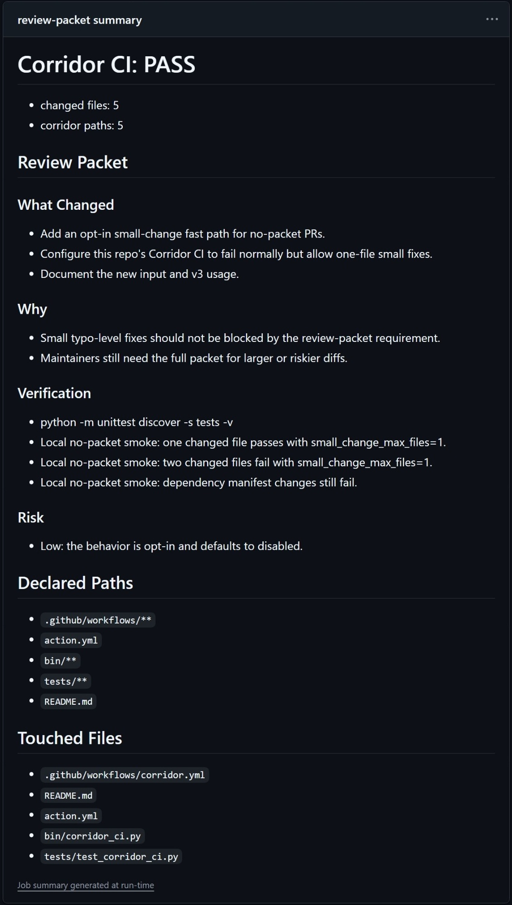
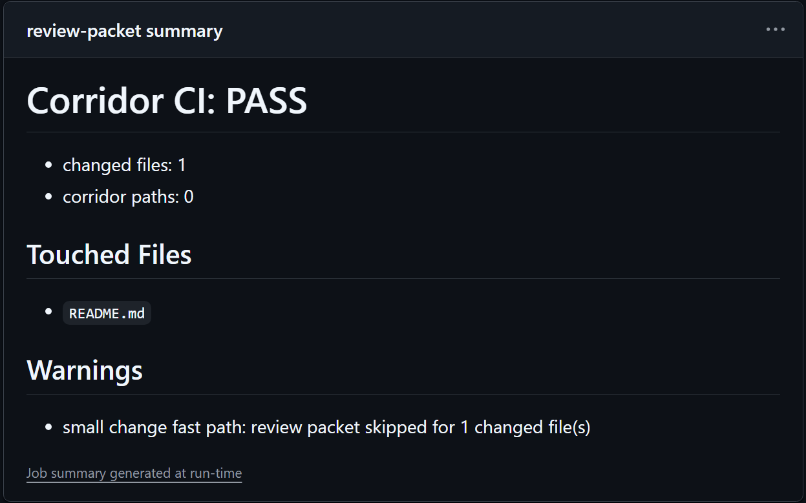

# Corridor CI

**No scope, no review.**

Maintainers are getting buried by low-context PRs.

AI-assisted PRs are not automatically bad. The problem is a PR that takes less
effort to submit than it takes to understand: too many files, unclear scope,
surprise dependencies, and no obvious stop condition. Review time gets spent
reconstructing what the PR was supposed to do.

Corridor CI moves that work back to the PR author.

It is not an AI detector, a spam score, or an AI reviewer. It asks two narrower
questions:

> Did the PR give maintainers a review packet?
> Did the actual diff stay inside that declared boundary?

The point is intentional friction. For non-trivial PRs, the scope work should
happen before maintainer review, not inside maintainer review.

## What It Looks Like

Big PRs must explain themselves. Tiny fixes still pass.

**Larger change: review packet summary**



**Tiny fix: no packet needed**



## What It Checks

For normal PRs, Corridor CI expects a review packet in `.corridor/review-packet.md` or
the PR body.

It checks that:

- The packet includes What Changed, Why, Paths, Non-goals, Verification, and Risk.
- The actual changed files stay inside the declared Paths section.
- Dependency manifest changes are blocked unless explicitly allowed.
- PRs over `max_changed_files` are blocked or warned.

If the packet is missing or incomplete, the failure summary includes a copyable
blank packet.

For tiny fixes, you can set `small_change_max_files` so one-file typo-level PRs
can pass without a review packet. Dependency manifest changes are still blocked.

Every run writes a compact GitHub step summary for maintainers.

It does not auto-close PRs. Start in `warn` mode, then switch to `fail` when the
policy is accepted by the project.

## Where It Fits

Corridor CI is a review-boundary gate.

It is intentionally smaller than most AI-era PR tools:

| tool type | what it does | how Corridor CI differs |
|---|---|---|
| AI reviewers | Review or summarize code with another model. | No model, no token cost, no generated review comments. |
| Anti-spam gates | Score suspicious contributors or AI-looking PRs. | Does not judge the author or decide whether AI was used. |
| PR templates | Ask contributors to fill in context. | Fails or warns when the required context is missing. |
| Policy engines | Let teams write custom approval rules. | Ships one narrow rule: explain the review boundary, then stay inside it. |

Use Corridor CI when you want a low-friction first gate before maintainer review,
not a full anti-spam system.

## Quick Start

```yaml
name: Corridor CI

on:
  pull_request:

jobs:
  corridor:
    runs-on: ubuntu-latest
    steps:
      - uses: actions/checkout@v4
        with:
          fetch-depth: 0

      - uses: shihchengwei-lab/corridor-ci@v6
        with:
          mode: warn
          max_changed_files: 12
```

After the team is ready:

```yaml
      - uses: shihchengwei-lab/corridor-ci@v6
        with:
          mode: fail
          small_change_max_files: 1
          max_changed_files: 12
```

`v1` remains available for the older scope-only gate. `v2` requires a review
packet for every PR. `v3` adds the tiny-fix fast path. `v4` uses the neutral
`.corridor/review-packet.md` file path by default. `v5` adds `Paths: auto`
and copyable failure templates. `v6` defaults to `warn` mode.

If you do not want typo-level fixes to get stuck, set
`small_change_max_files`. A PR without a review packet can pass only when the
changed-file count is at or below that value and it does not touch dependency
manifests. Larger changes still need the review packet, so this is only for
low-friction fixes.

## Review Packet Format

Put this in the PR body. If you prefer a committed file, use
`.corridor/review-packet.md`:

```md
# Review Packet: rating-widget

## What Changed
- Add a controlled rating input.

## Why
- The app needs a reusable rating control.

## Non-goals
- Do not refactor forms.
- Do not add dependencies.

## Paths: auto

## Verification
- Existing frontend tests still pass.

## Risk
- Low: isolated UI component.
```

`Paths: auto` tells Corridor CI to use the actual changed files as the declared
boundary. If you prefer a hand-written boundary, use a `Paths` section with glob
patterns:

```md
## Paths
- frontend/src/components/ui/**
- frontend/tests/**
```

The other sections are required because they make the PR reviewable without
forcing maintainers to reconstruct intent from the diff.

The CI summary then gives maintainers a compact packet:

```md
## Review Packet

### What Changed
- Add a controlled rating input.

### Why
- The app needs a reusable rating control.

### Verification
- Existing frontend tests still pass.

### Risk
- Low: isolated UI component.

## Touched Files
- frontend/src/components/ui/rating.tsx
- frontend/tests/rating.spec.ts
```

## Inputs

| input | default | meaning |
|---|---:|---|
| `mode` | `warn` | `fail` exits non-zero on issues; `warn` only reports. |
| `source` | `auto` | `auto`, `file`, or `body`. Auto checks file first, then PR body. |
| `corridor_file` | `.corridor/review-packet.md` | File to read when using file source. |
| `corridor_required` | `true` | Require a corridor. |
| `allow_dependencies` | `false` | Allow dependency manifest changes. |
| `max_changed_files` | `0` | Optional changed-file limit. `0` disables it. |
| `small_change_max_files` | `0` | Allow no-packet small changes up to this file count. `0` disables it. |
| `base_ref` | empty | Git diff base ref. Defaults to the pull request base branch. |
| `changed_files` | empty | Optional comma/newline changed-file list. Use `@path` to read a list file. |

## Philosophy

This is the receiving-side half of agent discipline.

Author-side rules help contributors keep their change scoped while they write
code. Corridor CI is the receiving-side gate: it helps maintainers reject
unclear scope before review.

The rule is simple:

> If a PR cannot say where it is allowed to move, maintainers should not spend
> time discovering that boundary by review.

## License

MIT
