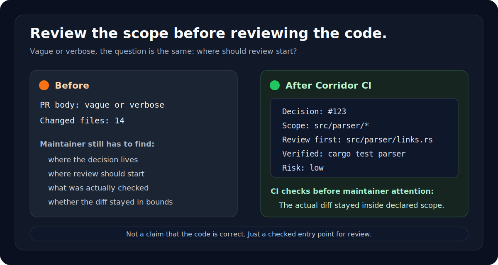

# Corridor CI

**First-glance PR triage before deep review.**

Corridor CI is a small GitHub Action for maintainers who need a quick answer
before spending review attention: is this PR ready for a close look, and where
should that look start?

It asks non-trivial PRs for a compact handoff:

```md
Decision: #123
Scope: pkg/parser/*, tests/parser/*
Review first: pkg/parser/links.py
Verified: pytest tests/parser
Risk: low
```

`Decision` points to where the why already lives: an issue, discussion, RFC,
spec, bug reproduction, maintainer request, or a clearly small fix.

`Scope` is the declared review boundary. With explicit paths or globs, Corridor
CI compares the actual diff against the stated boundary and reports when the PR
touched more than it said it would.

`Scope: auto` is still available when a project only wants low-friction review
visibility. It turns the actual changed files into the review boundary.

It is not an AI detector, a spam score, an AI reviewer, or a code quality check.
Humans still review the code. A red check means information is missing or the
declared boundary does not match the diff; it does not mean the code is bad.

For agent-authored PRs, the value is a shaping signal: say why the change
exists, declare where it was meant to stop, and point the maintainer at the
first file to read.



## Quick Start

```yaml
name: Corridor CI

on:
  pull_request:
    types: [opened, edited, synchronize, reopened]

jobs:
  corridor:
    runs-on: ubuntu-latest
    steps:
      - uses: actions/checkout@v4
        with:
          fetch-depth: 0

      - uses: shihchengwei-lab/corridor-ci@v8
        with:
          mode: warn
          small_change_max_files: 1
          max_changed_files: 12
```

Start with `mode: warn`. Switch to `mode: fail` after the project accepts the
rule.

Add this to the PR body:

```md
Decision: #123
Scope: pkg/parser/*, tests/parser/*
Review first: pkg/parser/links.py
Verified: pytest tests/parser
Risk: low
```

The cheapest adoption path is to copy
[`examples/PULL_REQUEST_TEMPLATE.md`](examples/PULL_REQUEST_TEMPLATE.md) to
`.github/PULL_REQUEST_TEMPLATE.md`.

The standalone format spec is in
[`docs/HANDOFF_SPEC.md`](docs/HANDOFF_SPEC.md).

## Handoff Notes

`Decision` can be an issue, discussion, RFC, spec, bug reproduction, maintainer
request, URL, or small self-contained fix.

Use explicit paths or globs when you want the PR to stay inside a declared
corridor:

```md
Scope: pkg/parser/*, tests/parser/*
```

Use `Scope: auto` only when you want low-friction review visibility. It uses the
actual changed files as the review boundary.

`Review first` must be one of the changed files.

Glob matching uses Python `fnmatch` semantics. `*` can cross `/`, so `pkg/*`
also matches nested paths. `dir/**` means the directory and the whole subtree.

## What It Checks

- Required handoff fields exist.
- Explicit `Scope` paths or globs cover the changed files.
- `Scope: auto` resolves to the actual changed files when chosen.
- `Review first` points to a changed file.
- Dependency manifest changes are blocked unless explicitly allowed.
- PRs over `max_changed_files` are blocked or warned.
- Tiny PRs can skip the handoff when `small_change_max_files` allows it.

Warnings never block. Corridor CI warns when a scope pattern carries no
information, when `Decision` has no issue/discussion/URL reference, or when the
PR body is too long to keep the compact handoff easy to find.

If the handoff is missing or incomplete, the CI summary includes a copyable blank
handoff.

Every run writes a GitHub step summary for maintainers.

## Sticky PR Comment

Set `comment: true` to upsert the same report as a sticky PR comment.

```yaml
permissions:
  contents: read
  pull-requests: write

steps:
  - uses: shihchengwei-lab/corridor-ci@v8
    with:
      comment: true
```

Fork PRs can receive a read-only `GITHUB_TOKEN`, which may make the comment API
return `403`. Corridor CI logs one line and continues; the step summary is still
written.

## Bots

Skip bot PRs at the job or step level:

```yaml
jobs:
  corridor:
    if: github.actor != 'dependabot[bot]'
```

## Inputs

| input | default | meaning |
|---|---:|---|
| `mode` | `warn` | `fail` exits non-zero on issues; `warn` only reports. |
| `small_change_max_files` | `0` | Allow no-handoff small changes up to this file count. `0` disables it. |
| `max_changed_files` | `12` | Optional changed-file limit. `0` disables it. |
| `allow_dependencies` | `false` | Allow dependency manifest changes. |
| `comment` | `false` | Upsert the report as a sticky PR comment. |

## Philosophy

Corridor CI is a receiving-side triage aid. It helps maintainers decide whether
a PR has enough review context and gives authors a small structure for handing
work over.

The rule is simple:

> If a PR wants review, it should say why it exists, where it meant to move, and
> where the reviewer should start.

## License

MIT
